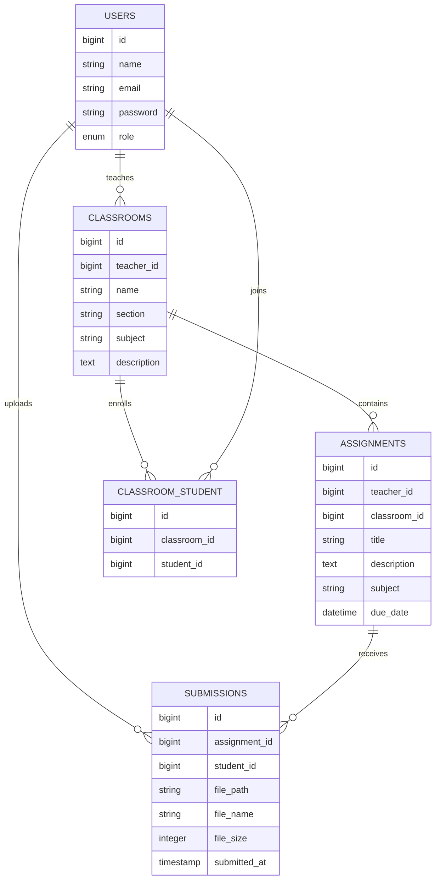

# Classroom Assignment Submission Portal

A Laravel-based classroom assignment submission system for teachers and students. The portal lets teachers create classrooms, enroll registered students, post activities with instructions and deadlines, and review submitted files. Students can view their enrolled classrooms, open activities, upload files, and replace previous submissions without creating duplicate records.

## Features

- Role-based authentication using Laravel Breeze
- Teacher and student access control through middleware
- Teacher classroom management
- Student enrollment per classroom
- Assignment/activity CRUD for teachers
- Activity instructions, subject, and deadline fields
- Student classroom dashboard
- Student file upload and re-upload
- Duplicate prevention using one submission per student per assignment
- Teacher submission history per assignment
- File size display and submission timestamps
- Late/on-time submission indicators
- MySQL database with Eloquent relationships and migrations

## User Roles

### Teacher

- Create and manage classrooms
- Add registered students to classrooms
- Create activities for a classroom
- Add activity instructions and deadline
- View submitted files per activity
- Download student submissions

### Student

- View enrolled classrooms
- Open classroom activities
- Read activity instructions
- Upload assignment files
- Re-upload to replace a previous submission
- See success messages after upload

## Tech Stack

- Laravel 12
- Laravel Breeze
- MySQL
- Blade templates
- Tailwind CSS / Vite
- Eloquent ORM
- Laravel Storage facade

## Database Schema Overview



### users

Stores teacher and student accounts.

- id
- name
- email
- password
- role: `teacher` or `student`

### classrooms

Stores classrooms created by teachers.

- id
- teacher_id
- name
- section
- subject
- description

### classroom_student

Pivot table for student classroom enrollment.

- id
- classroom_id
- student_id

### assignments

Stores posted activities or assignments.

- id
- teacher_id
- classroom_id
- title
- description
- subject
- due_date

### submissions

Stores uploaded student files.

- id
- assignment_id
- student_id
- file_path
- file_name
- file_size
- submitted_at

The `submissions` table has a unique constraint on `assignment_id` and `student_id`, so a student can only have one active submission per assignment. Re-uploading replaces the previous file.

## Setup Instructions

1. Clone the repository.

```bash
git clone <repository-url>
cd casp
```

2. Install PHP dependencies.

```bash
composer install
```

3. Install frontend dependencies.

```bash
npm install
```

4. Copy the environment file.

```bash
copy .env.example .env
```

5. Generate the application key.

```bash
php artisan key:generate
```

6. Configure MySQL in `.env`.

```env
DB_CONNECTION=mysql
DB_HOST=127.0.0.1
DB_PORT=3306
DB_DATABASE=casp
DB_USERNAME=root
DB_PASSWORD=
```

7. Run migrations and seeders.

```bash
php artisan migrate --seed
```

8. Link storage for uploaded files.

```bash
php artisan storage:link
```

9. Build frontend assets.

```bash
npm run build
```

10. Start the Laravel development server.

```bash
php artisan serve
```

Open the app at:

```text
http://127.0.0.1:8000
```

## Demo Accounts

After running `php artisan migrate --seed`, these accounts are available:

```text
Teacher
Email: teacher@example.com
Password: password

Student
Email: student@example.com
Password: password

Student 2
Email: student2@example.com
Password: password
```

## File Upload Rules

Accepted file types:

- PDF
- Word documents
- Excel files
- PowerPoint files
- TXT
- ZIP / RAR
- JPG / JPEG / PNG

Maximum upload size:

```text
500 MB
```

Server settings such as `upload_max_filesize` and `post_max_size` must also allow large uploads.

## Project Scope

Included:

- Assignment posting and management
- Classroom-based student access
- File upload submissions
- Submission tracking and timestamps
- Role-based teacher/student views
- File validation

Not included:

- Grading
- Teacher feedback or annotations
- Plagiarism detection
- Cloud storage integration
- Email notifications

## Running Tests

```bash
php artisan test
```

## Group Members

- Member 1:John Ron B. Diza
- Member 2:Stephany M. Galo
- Member 3:Paul Batac
- Member 4:Justine Jhess Domenden
- Member 5:Aldrey Butalid
## Notes for Live Demo

Recommended demo flow:

1. Log in as teacher.
2. Create a classroom.
3. Add registered students to the classroom.
4. Create an activity with instructions and deadline.
5. Log in as student.
6. Open the classroom.
7. Submit a file.
8. Log back in as teacher.
9. Open the classroom activity submissions and download the submitted file.
